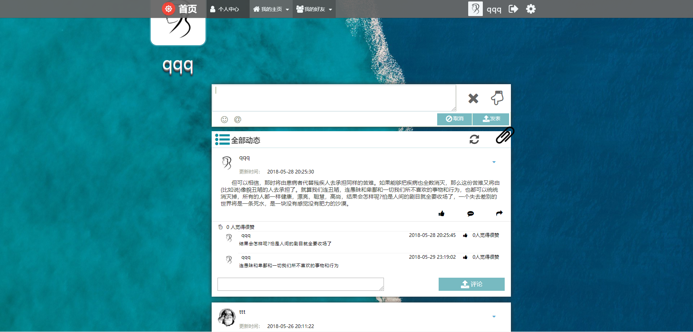
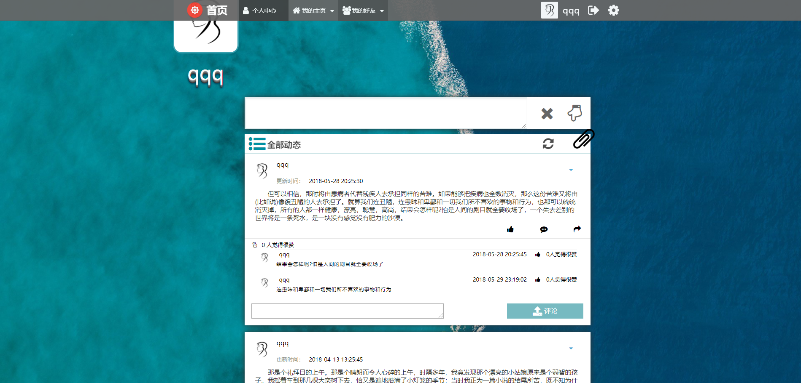

# personal
personal_web 
这是一个php+mysql+jquery编写的论坛网站  
<strong>登陆/注册界面</strong> 
<b>描述：</b>
该页面有两个功能，即登陆注册功能，可以勾选七天内自动登陆。

 
<strong>文章显示页</strong> 
<b>描述：</b>
该页面多处运用ajax页面局部刷新，配合jquery使用，可以更新预览头像，动态加载文章，下拉加载文章，更新用户个人信息，以及动态添加移除文章。该页面还提供评论和点赞功能，并且都是实时的刷新，有点赞特效。

 
<strong>个人文章页</strong> 
<b>描述：</b>
该页面具有和文章显示页一样的功能，但是只显示自己发表的文章，并且有删除文章选项，可以级联删除所有关联表的内容。

 
